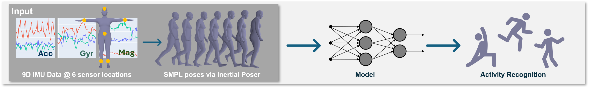

# harpose

**harpose: Towards Inertial Pose-Based Human Activity Recognition Using Only IMUs**



---

## Overview

harpose investigates how inertial-based human activity recognition (HAR) can be improved by incorporating a human body model via an inertial poser. For this we look at

- IMU sensor data (accelerometer, gyroscope, magnetometer)
- SMPL pose representations
- Fusion of multimodal representations (IMU + pose)

This repository contains:

- Some preprocessing
- Code for LOSO evaluation
- IMU-based, pose-based, and multimodal fusion models
- and experiments of those   

Disclaimer: In this experiments we do not use SMPL poses produced by an inertial poser, but use ground-truth poses instead.  

---
## Setup Instructions

### 1. Download Required Models and Data and Python dependencies

**SMPL Models**  
Download from:  
https://smpl.is.tue.mpg.de/  
Place inside:
```
harpose/0_SMPL_models/
```

**TotalCapture Dataset**  
Download from:  
https://cvssp.org/data/totalcapture/

**AMASS SMPL Data for TotalCapture**  
Download from:  
https://amass.is.tue.mpg.de/

Additional details are provided in the README inside `1_data_pipeline/`.

Install Python dependencies

```
pip install -r requirements.txt
```


---

### 2. Process the IMU + SMPL Data

Run the preprocessing script:

```
process_imu_smpl.py
```

This generates the file:

```
windowed_smpl_imu.csv
```


### 3. Create Models based on IMU + SMPL Data and perform Experiments
The resulting data is used for LOSO cross-validated experiments across three model families:  

* A) IMU-based approaches found in ```A_imu_based_har```   
* B) Pose-based approaches found in ```B_pose_based_har```   
* C) IMU + pose fusion approaches found in ```C_imu+pose_based_har```   
Where the modelsi n C) depend on the results from A) and B).   
A) and B) can be run independently. 
---


## Summary of Experiments

| Experiment | Model | Accuracy (Mean ± SD) | Macro F1 (Mean ± SD) |
|-----------|--------|-----------------------|------------------------|
| **LGBM (IMU) + CNN (POSE)** | LGBM (IMU, A1) | 0.707 ± 0.028 | 0.527 ± 0.053 |
| | CNN (POSE, B1) | 0.739 ± 0.099 | 0.586 ± 0.088 |
| | Weighted Fusion | 0.769 ± 0.062 | 0.608 ± 0.057 |
| | Oracle Fusion | 0.828 ± 0.044 | 0.678 ± 0.080 |
| **DCL (IMU) + CNN (POSE)** | DCL (IMU, A2) | 0.685 ± 0.081 | 0.509 ± 0.064 |
| | CNN (POSE, B1) | 0.739 ± 0.099 | 0.586 ± 0.088 |
| | Weighted Fusion (C1) | 0.766 ± 0.066 | 0.605 ± 0.069 |
| | Oracle Fusion (C2) | 0.842 ± 0.047 | 0.684 ± 0.059 |


---
