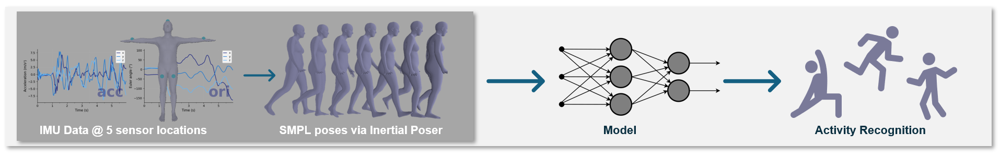

# harpose

**harpose: Towards Inertial Pose-Based Human Activity Recognition Using Only IMUs**



---

## Overview

harpose investigates how inertial-based human activity recognition (HAR) can be improved by incorporating a human body model via an inertial poser. We compare:

- **(A) IMU-based HAR** — feature-based and deep models classifying activity directly from IMU signals.
- **(B) Pose-based HAR** — models classifying activity from SMPL body pose sequences, evaluated under both ground-truth pose (GT) and pose estimated from the same IMU signals via an inertial poser (PRED).
- **(C) Fusion of IMU and pose** — confidence-threshold fusion and an oracle upper bound combining (A) and (B).

All models are evaluated with subject-wise Leave-One-Subject-Out (LOSO) cross-validation on TotalCapture (5 subjects, 4 activities, 50-frame windows at 30Hz).

This repository contains the final model/experiment code corresponding to the paper, plus the tooling that fuses the windowed IMU/pose CSVs into the single input table the models read from. It does not redistribute any raw data, licensed body models, pretrained inertial-poser checkpoints, or generated embeddings; the windowed CSVs themselves (see Setup) must be obtained/regenerated separately.

---

## Repository structure

```
harpose/
├── data_pipeline/         # place the fused windowed CSV here (gitignored, not tracked) — see Setup
├── SMPL_tools/            # minimal forward-kinematics utility (articulate.model.ParametricModel), used by B3/B4
├── models/
│   ├── A/                 # category-A IMU-only models (A1 LightGBM, A2 DeepConvLSTM, A3 CNNHAR, A4 Attend&Discriminate, A5 TinyHAR)
│   ├── B/                 # category-B pose-only models (B1 SMPL-CNN, B2 vel-CNN, B3 TCN-FK, B4 ST-GCN)
│   └── C/                 # category-C fusion models (C1 threshold fusion, C2 oracle), each for A1+B3 and A2+B3
└── requirements.txt
```

Each model script under `models/` is self-contained (LOSO loop, training, evaluation, per-fold embedding/logit export) except `B3_TCN_FK.py` and `B4_STGCN.py`, which use `SMPL_tools` for forward kinematics (`B4_STGCN.py` imports its FK helpers directly from `B3_TCN_FK.py`).

**A2 (DeepConvLSTM)** uses gravity-corrected accelerometer + orientation + gyroscope from the fused CSV (`models/A/A2_DeepConvLSTM.py`) — its embeddings double as both the A2 standalone result and the IMU branch input for `models/C`.

---

## Setup

### 1. Download required models and data

**SMPL body model** — register at https://smpl.is.tue.mpg.de/. Any one model file works — male, female, or neutral; place/rename it to:
```
SMPL_tools/smpl/basicmodel_m.pkl
```

**TotalCapture dataset** — request access to the TotalCapture dataset here: https://cvssp.org/data/totalcapture/. Download the Vicon groundtruth in the `raw` folder, and the IMU data in the `IMU` folder.

**AMASS SMPL fits for TotalCapture** — https://amass.is.tue.mpg.de/

**MobilePoser checkpoint / predicted-pose `.pt` files** — [github.com/SPICExLAB/MobilePoser](https://github.com/SPICExLAB/MobilePoser); required only for the PRED-pose conditions.

### 2. Install Python dependencies

Create a conda environment (Python 3.10) and install the pinned dependencies:

```bash
conda create -n harpose python=3.10
conda activate harpose
pip install -r requirements.txt
```

### 3. Place the fused windowed CSV

Every category A/B/C model reads from a single fused CSV (IMU + GT/PRED pose + GT/PRED translation), picking out only the columns it needs by name/prefix. Place it at:
```
data_pipeline/results_30hz_fused_acc_ori_gyr_pose/windowed_30hz_fused_acc_ori_gyr_pose_lw_rw_lp_rp_h.csv
```
(gitignored; not redistributed, too large). Its columns:

| Columns | Count | Content |
|---|---|---|
| `activity_num`, `activity`, `activity_encoded`, `subject`, `file_path`, `window_idx` | 6 | metadata |
| `acc_{x,y,z}_{1..5}` | 15 | gravity-corrected accelerometer, 5 sensors |
| `ori_{ij}_{1..5}` (i,j ∈ {0,1,2}) | 45 | orientation (3×3 rotation matrix), 5 sensors |
| `gyr_{x,y,z}_{1..5}` | 15 | gyroscope, 5 sensors |
| `poseT_{ij}_{0..23}` (i,j ∈ {0,1,2}) | 216 | ground-truth SMPL pose (3×3 rotation matrix × 24 joints) |
| `poseP_{ij}_{0..23}` (i,j ∈ {0,1,2}) | 216 | inertial-poser-predicted SMPL pose |
| `tranT_{x,y,z}`, `tranP_{x,y,z}` | 6 | ground-truth / predicted global translation (not used here) |

519 columns total, 2902 rows (one per window); each cell holds a 50-element list — one value per frame, sampled at 30Hz (1.67s window).

### 4. Run the experiments

Category A and B models can be run independently; category C depends on the per-fold embeddings/logits produced by an A and a B script (run those first). Run any script directly, e.g.:

```bash
python models/A/A1_LightGBM.py
python models/B/B3_TCN_FK.py
python models/C/C1_A2_B3_fusion.py
```

---

## Summary of results (LOSO, mean ± std over 5 subjects)

| Cat. | Model | Pose | macro-F1 | Accuracy |
|---|---|---|---|---|
| A | A1 LightGBM | – | 0.545 ± 0.061 | 0.681 ± 0.095 |
| A | A2 DeepConvLSTM | – | 0.546 ± 0.044 | 0.710 ± 0.040 |
| A | A3 CNNHAR | – | 0.522 ± 0.049 | 0.674 ± 0.075 |
| A | A4 Attend&Discriminate | – | 0.527 ± 0.017 | 0.683 ± 0.063 |
| A | A5 TinyHAR | – | 0.522 ± 0.028 | 0.665 ± 0.064 |
| B | B1 SMPL-CNN | GT / PRED | 0.564 ± 0.081 / 0.537 ± 0.085 | 0.708 ± 0.122 / 0.672 ± 0.076 |
| B | B2 vel-CNN | GT / PRED | 0.587 ± 0.061 / 0.529 ± 0.090 | 0.754 ± 0.068 / 0.675 ± 0.061 |
| B | B3 TCN-FK | GT / PRED | 0.573 ± 0.040 / 0.562 ± 0.045 | 0.737 ± 0.068 / 0.703 ± 0.019 |
| B | B4 ST-GCN | GT / PRED | 0.552 ± 0.053 / 0.529 ± 0.058 | 0.728 ± 0.077 / 0.702 ± 0.090 |
| C | C1 Threshold Fusion (A2+B3) | GT / PRED | 0.588 ± 0.037 / 0.574 ± 0.043 | 0.749 ± 0.059 / 0.730 ± 0.021 |
| C | C1 Threshold Fusion (A1+B3) | GT / PRED | 0.589 ± 0.044 / 0.572 ± 0.044 | 0.744 ± 0.058 / 0.719 ± 0.024 |
| C | C2 Oracle (A2+B3) | GT / PRED | 0.660 ± 0.051 / 0.651 ± 0.047 | 0.820 ± 0.040 / 0.817 ± 0.035 |
| C | C2 Oracle (A1+B3) | GT / PRED | 0.659 ± 0.072 / 0.655 ± 0.060 | 0.807 ± 0.054 / 0.808 ± 0.036 |

All category-A models use the same 75-channel input (acc + ori + gyr) from the fused CSV.

`models/plot_confusion_matrices.py` generates pooled (all-fold) row-normalized (recall) and column-normalized (precision) confusion matrices for every model into `figures/confusion_matrices/` — run it after the model scripts above.

---

## Acknowledgments

We're grateful to the authors of the following open-source projects, without which this work would not have been possible:

- **SMPL forward kinematics** (`SMPL_tools/articulate/`) is trimmed from the `articulate` toolkit released with Xinyu Yi et al.'s **TransPose** ([github.com/Xinyu-Yi/TransPose](https://github.com/Xinyu-Yi/TransPose)) and **PIP**, with `ParametricModel` adapted from [CalciferZh/SMPL](https://github.com/CalciferZh/SMPL). Many thanks to the authors for making this code available.
- **MobilePoser** ([github.com/SPICExLAB/MobilePoser](https://github.com/SPICExLAB/MobilePoser)) was used to generate the predicted SMPL poses (PRED condition); checkpoints are not redistributed here. We thank the authors for sharing their model.
